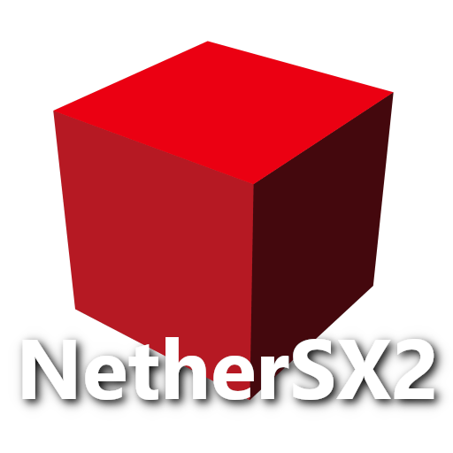

<div align=center>



</div>
<h1 align=center>NetherSX2 · Switch Port</h1>

A wrapper/port of NetherSX2 to the Nintendo Switch.
It loads the original Android emulator core `libemucore.so`, 
patches it, and runs it inside a minimal Android-like
environment natively.

Everything ships as a **single `NetherSX2.nro`**: it bundles both emulator cores
(Patched `4248` + Classic `3668`), both renderer backends (OpenGL + Vulkan/NVK)
and each build's data files, and extracts the ones you pick to the SD card at
launch. An SDL cover-art launcher chooses the game, the renderer, and per-game
settings, then chainloads the emulator.

The launcher supports multiple library folders across SD, USB mass storage, and SMB shares.

**L + R + Plus** to open the quick menu for save states, controller rebinding,
frame-limiter control, reset, and exit.

No emulator core, BIOS, or game assets are included in this repository.

### How to install

1. Copy `NetherSX2.nro` into `/switch/` on your SD card.
2. Put your own PS2 BIOS dump into `/switch/nethersx2/bios/`.

The launcher creates the rest of the folder tree on first run:

```
/switch/NetherSX2.nro
/switch/nethersx2/
  bios/         <- your PS2 BIOS dump           (you supply)
  resources/    <- shaders / GameIndex / fonts  (auto-extracted per core)
  covers/       <- cover art (<game-key>.png)
  gamecfg/      <- per-game launcher settings
  forwarders/   <- HOME shortcut launch records
  launcher.ini  <- the launcher's saved config
```

### Notes

This will not run in applet/album mode — it needs the full memory of a game
override. Launch it by holding **R** while opening an installed title, or use a
forwarder.

A PS2 BIOS dump is required and must come from your own console; the launcher
warns at startup when `bios/` is empty.

### How to build

Install the devkitPro Switch toolchain and portlibs:

```sh
pacman -S devkitA64 switch-tools libnx switch-sdl2 switch-sdl2_ttf \
          switch-sdl2_image switch-curl switch-mesa switch-libdrm_nouveau
```

Provide a compatible Mesa NVK package under `vulkan/include` and `vulkan/lib`.
Extract the 4248 and 3668 APKs into sibling folders named
`NetherSX2-v2.2n-4248` and `NetherSX2-v2.2n-3668`, or set `CORES_DIR` to the
folder containing them. CMake, Ninja, and Git are required; the build downloads pinned
libsmb2 and libusbhsfs revisions.

```sh
./build_all.sh
```

### Credits

* The AetherSX2 / PCSX2 developers for the emulator.
* The NetherSX2 maintainers for the patched Android builds.
* fgsfds for the Switch so-loader groundwork reused here.
* TheOfficialFloW for the original Android so-loader lineage.
* Dantiicu for Switch Vulkan driver.
* Slluxx for IconGrabber.

### Support

If you enjoy my work and want to support me :

[](https://ko-fi.com/D1D1P2MOG)

### Legal

This project has no affiliation with the AetherSX2 or PCSX2 developers. No BIOS,
game images, or the emulator core are distributed here; you must supply your own
BIOS dump and legally-owned game images. We do not condone piracy.

Unless noted otherwise, the source in this repository is under the MIT License
(see LICENSE).
